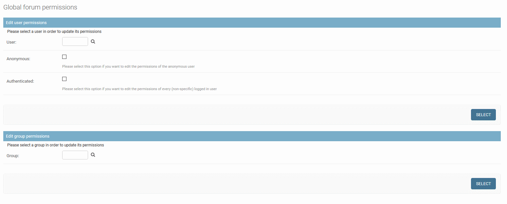
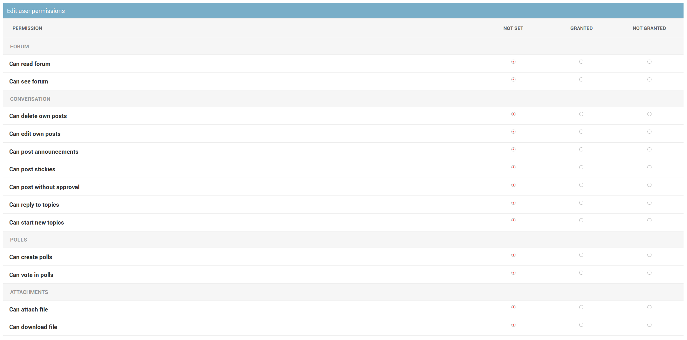
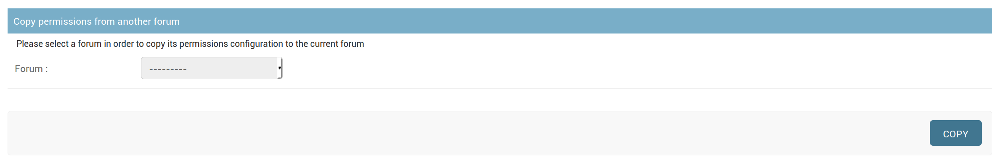

#################
Forum permissions
#################

Django-machina comes with its own permission system, allowing you to define exactly what users or
groups can or can not do with the forums you created.

Permissions can be granted to users (anonymous user or registered users) and to groups. Some
permissions can be granted globally: in this case, the permissions apply to all forums.

Built-in permissions
--------------------

+-------------------------------+-----------+--------------------------------------------------+
| Permission                    | Is global | Definition                                       |
+===============================+===========+==================================================+
| **Forums**                                                                                   |
+-------------------------------+-----------+--------------------------------------------------+
| ``can_see_forum``             | Yes       | Defines whether the target can see a forum       |
|                               |           | (eg. in the list of forums)                      |
+-------------------------------+-----------+--------------------------------------------------+
| ``can_read_forum``            | Yes       | Defines whether the target can read the content  |
|                               |           | of a forum                                       |
+-------------------------------+-----------+--------------------------------------------------+
| **Topics and posts**                                                                         |
+-------------------------------+-----------+--------------------------------------------------+
| ``can_start_new_topics``      | Yes       | Defines whether the target can start a new topic |
+-------------------------------+-----------+--------------------------------------------------+
| ``can_start_new_topics``      | Yes       | Defines whether the target can start a new topic |
+-------------------------------+-----------+--------------------------------------------------+
| ``can_reply_to_topics``       | Yes       | Defines whether the target can reply to topics   |
+-------------------------------+-----------+--------------------------------------------------+
| ``can_post_announcements``    | Yes       | Defines whether the target can create announces  |
+-------------------------------+-----------+--------------------------------------------------+
| ``can_post_stickies``         | Yes       | Defines whether the target can create sticky     |
|                               |           | posts                                            |
+-------------------------------+-----------+--------------------------------------------------+
| ``can_delete_own_posts``      | Yes       | Defines whether the target can remove its own    |
|                               |           | posts                                            |
+-------------------------------+-----------+--------------------------------------------------+
| ``can_edit_own_posts``        | Yes       | Defines whether the target can edit its own      |
|                               |           | posts                                            |
+-------------------------------+-----------+--------------------------------------------------+
| ``can_post_without_approval`` | Yes       | Defines whether the target can create topics or  |
|                               |           | posts without moderator approval                 |
+-------------------------------+-----------+--------------------------------------------------+
| **Polls**                                                                                    |
+-------------------------------+-----------+--------------------------------------------------+
| ``can_create_polls``          | Yes       | Defines whether the target can create polls      |
+-------------------------------+-----------+--------------------------------------------------+
| ``can_vote_in_polls``         | Yes       | Defines whether the target can vote in polls     |
+-------------------------------+-----------+--------------------------------------------------+
| **Attachments**                                                                              |
+-------------------------------+-----------+--------------------------------------------------+
| ``can_attach_file``           | Yes       | Defines whether the target can attach files to   |
|                               |           | forum posts                                      |
+-------------------------------+-----------+--------------------------------------------------+
| ``can_download_file``         | Yes       | Defines whether the target can download the      |
|                               |           | files attached to forum posts                    |
+-------------------------------+-----------+--------------------------------------------------+
| **Moderation**                                                                               |
+-------------------------------+-----------+--------------------------------------------------+
| ``can_lock_topics``           | No        | **Moderation permission:** defines whether       |
|                               |           | the target can lock a forum topic                |
+-------------------------------+-----------+--------------------------------------------------+
| ``can_move_topics``           | No        | **Moderation permission:** defines whether       |
|                               |           | the target can move topics to another forum      |
+-------------------------------+-----------+--------------------------------------------------+
| ``can_edit_posts``            | No        | **Moderation permission:** defines whether       |
|                               |           | the target can edit forum posts that they did    |
|                               |           | not write                                        |
+-------------------------------+-----------+--------------------------------------------------+
| ``can_delete_posts``          | No        | **Moderation permission:** defines whether       |
|                               |           | the target can delete forum posts that they      |
|                               |           | did not write                                    |
+-------------------------------+-----------+--------------------------------------------------+
| ``can_approve_posts``         | No        | **Moderation permission:** defines whether       |
|                               |           | the target can approve unapproved posts          |
+-------------------------------+-----------+--------------------------------------------------+
| ``can_reply_to_locked_topic`` | No        | **Moderation permission:** defines whether       |
|                               |           | the target can add posts in locked topics        |
+-------------------------------+-----------+--------------------------------------------------+

Defining forum permissions
--------------------------

Django-machina allows you to precisely define which permissions should be granted for each forum,
for each user and for each group of users. The permissions can be granted from the administration
panel. Just go to the 'Forums' section of the administration panel. In this section you can update
forum instances and their related permissions.

.. note::

    Defining precise permissions on each forum can be overwhelming if you just want to set up single
    forums with a basic set of permissions. In that case you can use the
    ``MACHINA_DEFAULT_AUTHENTICATED_USER_FORUM_PERMISSIONS`` setting to define which permissions
    should be granted to all authenticated users for all forums (please refer to :doc:`settings`).

As previously stated, the forum permissions can be applied either to a specific forum or globally to
all forums:

* in order to edit global forum permissions, go to the list of forum instances in the administration
  panel and click on "Global forum permissions"
* in order to edit specific forum permissions, select a forum in the list of forum instances in the
  administration panel. Then click on "Forum permissions"

Note that global permissions have a lower priority than permissions that are associated with a
specific forum. For example, a forum will be hidden if it is tied with a permission defining that it
should not be accessible for a group of user, even if this forum can be accessed according to the
global permissions applying to all forums for this group of users.

The admin pages mentioned above ("Global forum permissions" or "Forum permissions" for specific
forums) allow you to select the user or group for which you want to set permissions. You have to
select a specific user, the anonymous user or a specific group in order to set its permissions.

Once you have selected a user or group, you access a page where you can set its permissions for the
considered forum (or for all the forums in case of global permissions). The form allows you to
define the state of each permission for the considered user or group. Each permission can be either
**not set**, **granted** or **not granted**.

Copying forum permissions
-------------------------

If you are on the permissions page of a specific forum, you can choose to copy the permissions
configuration of another forum in order to apply it to the current forum. This allows you to easily
apply a set of permission to many forums.

