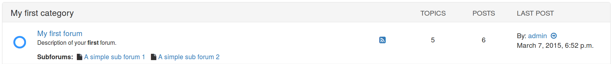

##########################################
Welcome to django-machina's documentation!
##########################################

|

*Django-machina* is a forum engine for Django providing a way to build community-driven websites. It offers a full-featured yet very extensible forum solution that is designed to be used inside existing Django applications.

*Django-machina* is customizable and extensible: each single functionality of the application can be customized or overriden to accommodate with your needs and your own business logic. The central aim of *django-machina* is to provide a solid core of a forum project - without much of extra functionality included - that can be extended or customized to suit your project needs.

Features
--------

* Forums tree management
* Per-forum permissions
* Topic and post editing
* Anonymous posting
* Pre-moderation and moderation
* Polls and attachments

Using django-machina
--------------------

.. toctree::
   :maxdepth: 2

   getting_started
   example_projects
   settings
   glossary
   forum_permissions
   customization/index
   machina_apps_reference/index
   contributing

Indices and tables
==================

* :ref:`genindex`
* :ref:`modindex`
* :ref:`search`
